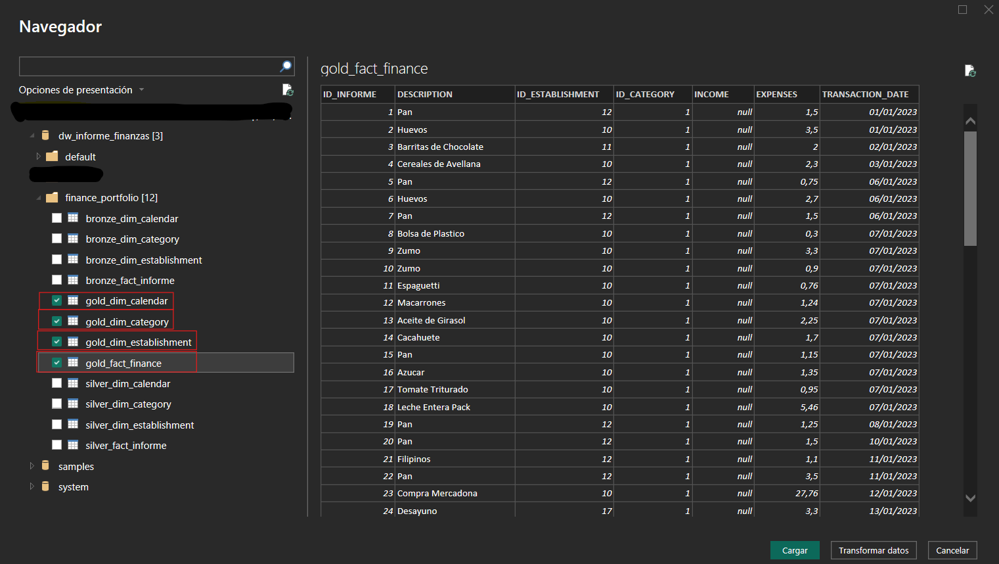
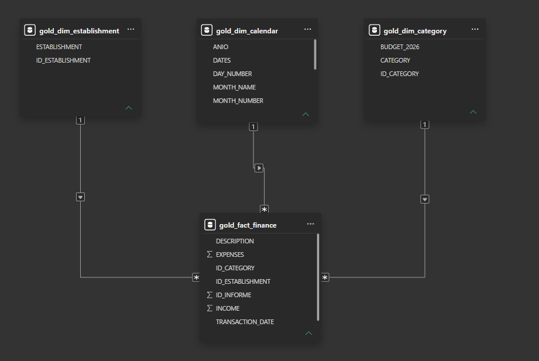
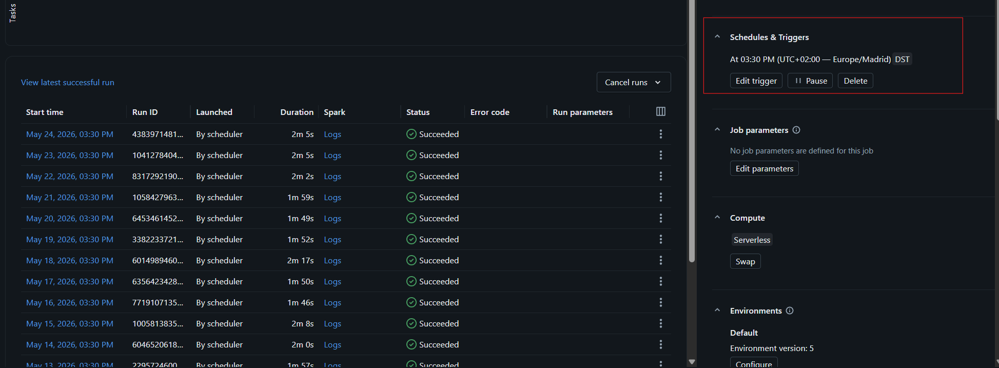
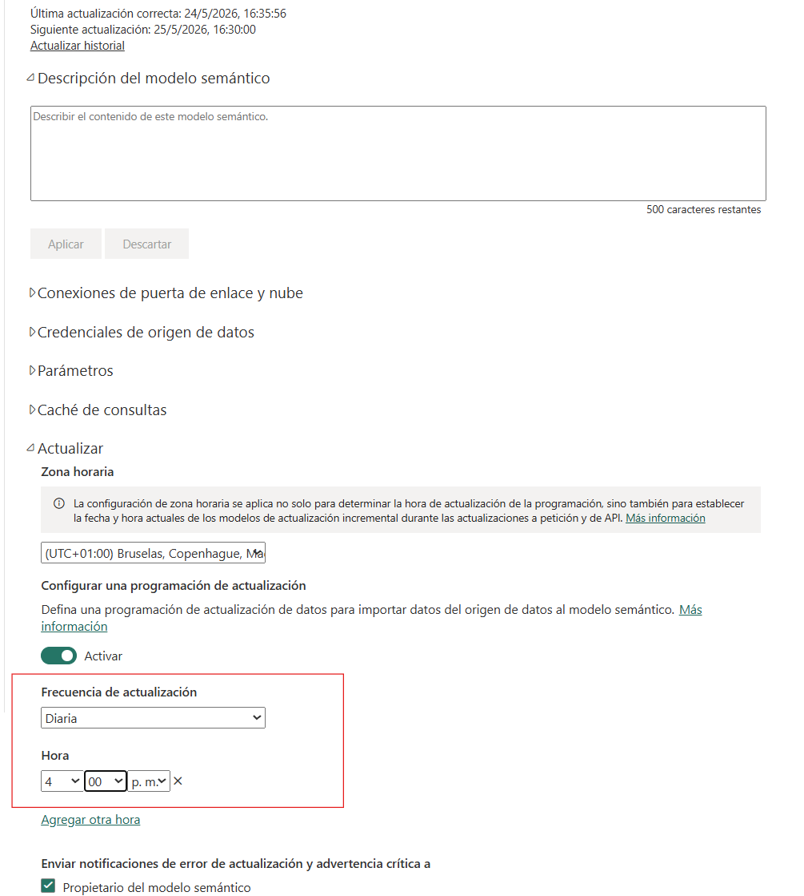
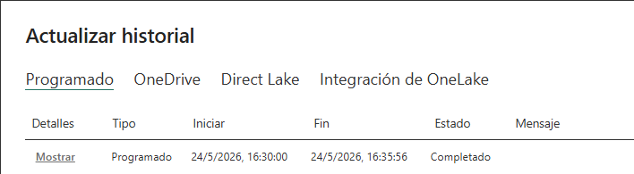
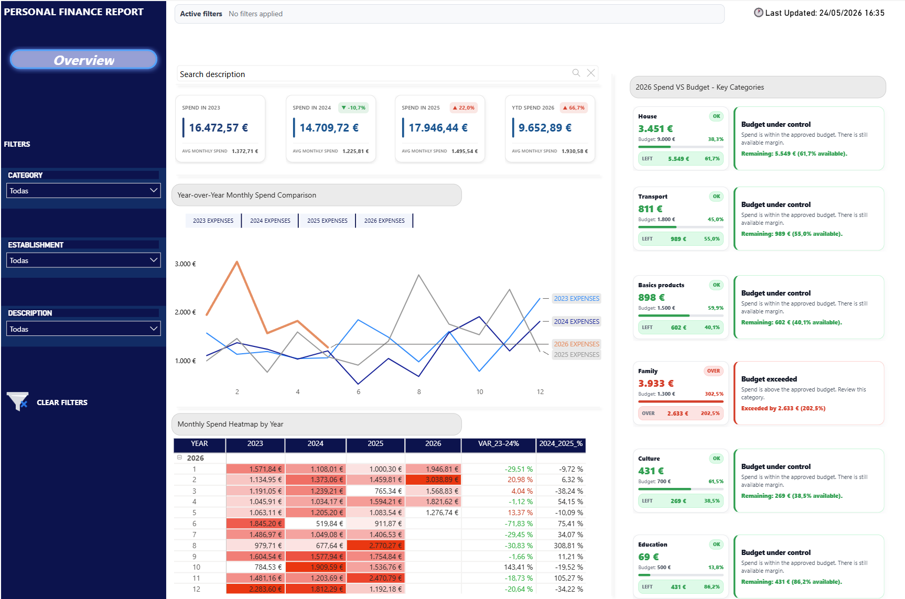

## Repository Structure

```text
databricks-finance-medallion-pipeline
│
├── notebooks
│   ├── 01_bronze_layer
│   │   ├── 00_configuration.sql
│   │   ├── 01_fact_expenses.sql
│   │   ├── 02_incremental_load_fact_expenses.sql
│   │   ├── 03_dim_category.sql
│   │   ├── 04_dim_establishment.sql
│   │   └── 05_dim_calendar.sql
│   │
│   ├── 02_silver_layer
│   │   ├── load_silver_tables
│   │   │   ├── 01_fact_expenses.sql
│   │   │   ├── 02_dim_category.sql
│   │   │   ├── 03_dim_establishment.sql
│   │   │   └── 04_dim_calendar.sql
│   │   │
│   │   └── data_validation
│   │       ├── 01_count_rows.sql
│   │       └── 02_validate_tables.sql
│   │
│   └── 03_gold_layer
│       └── load_gold_tables
│           ├── 01_fact_finance.sql
│           ├── 02_dim_category.sql
│           ├── 03_dim_establishment.sql
│           └── 04_dim_calendar.sql
│
├── README.md
└── .gitignore
```

---------------------------------------------------------------------------------
## Data Flow

The project follows a Medallion Architecture approach:

### Bronze Layer

The Bronze layer stores raw data loaded from CSV files into Delta tables.

Tables:

- `bronze_fact_expenses`
- `bronze_dim_category`
- `bronze_dim_establishment`
- `bronze_dim_calendar`

### Silver Layer

The Silver layer cleans, standardizes and validates the data.

Main transformations:

- Data type casting
- Text trimming
- Decimal normalization
- Date conversion
- Null validation
- Row count validation

Tables:

- `silver_fact_expenses`
- `silver_dim_category`
- `silver_dim_establishment`
- `silver_dim_calendar`

### Gold Layer

The Gold layer contains the final analytical model consumed by Power BI.

Tables:

- `gold_fact_finance`
- `gold_dim_category`
- `gold_dim_establishment`
- `gold_dim_calendar`

-----------------------------------------------------------------------------

## Screenshots

### Power BI Desktop connection to Databricks



This screenshot shows Power BI Desktop connected to the Databricks Gold Layer through Databricks SQL Warehouse.

### Power BI Model View



This screenshot shows the Power BI semantic model based on a star schema using the Gold tables.

### Databricks Scheduled Job



This screenshot shows the scheduled Databricks Job that runs the pipeline before the Power BI refresh.

### Power BI Service Scheduled Refresh



This screenshot shows the Power BI Service scheduled refresh configured after the Databricks Job execution.

### Power BI Refresh History



This screenshot shows a completed scheduled refresh in Power BI Service.

### Dashboard Overview



This screenshot shows the final Power BI report consuming the Gold Layer data.
